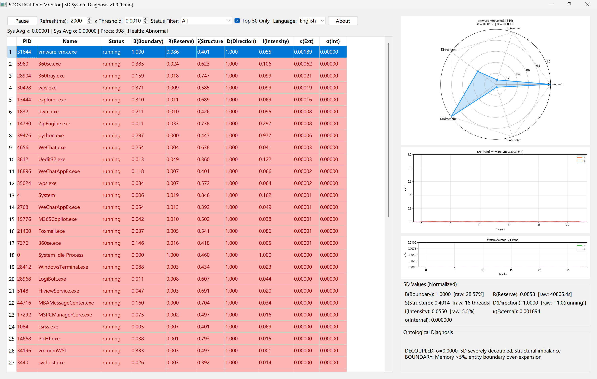

# 5DOS Real-time Local Monitor

五维操作系统诊断系统实时监控面板（双语版）  
Five-Dimensional Operating System Probe — Real-time GUI Monitor (Bilingual)

**Python 3.8+ | MIT License | Windows & Linux | PyQt5 GUI**

---

## Overview

Traditional monitoring tools (top, htop, Windows Task Manager) rely on single-dimensional thresholds such as CPU > 80% or memory > 400 MB. They fail to detect complex pathologies like "sufficient memory but handle leakage" or "idle CPU but exploding thread counts."

**5DOS Real-time Monitor v1.0** maps every OS process into five dimensions — **Boundary (B), Reserve (R), Structure (S), Direction (D), and Intensity (I)** — and computes **external synergy (κ)** and **internal synergy (σ)** via the **ratio-based matching method**. This enables cross-platform, real-time diagnosis with a unified PyQt5 bilingual dashboard.

---

## Core Formula (Ratio Method)

### Matching Degree
The ratio matching degree between two non-negative values:

γ(a, b) = min(a, b) / max(a, b)

When a = b, γ = 1 (perfect match). When min(a, b) = 0, γ = 0 (complete mismatch).

### External Synergy Coefficient κ
Measures how close each dimension is to the normalized ideal upper bound (1.0):

κ = ∏_{d∈{B,R,S,D,I}} γ(x_d, 1.0) = ∏_{d∈{B,R,S,D,I}} x_d

### Internal Synergy Coefficient σ
Measures five-dimensional balance via ten pairwise matching degrees:

σ = ∏_{1 ≤ i < j ≤ 5} γ(x_i, x_j)

---

## Five Dimensions

| Dim | Symbol | Meaning | Raw Metric | Normalization |
|-----|--------|---------|------------|---------------|
| Boundary | B | Memory footprint ratio | `memory_percent()` | `min(B/5.0, 1.0)` |
| Reserve | R | Cumulative CPU time | `cpu_times().user + .system` | `min(R / max_global_R, 1.0)` |
| Structure | S | Thread count | `num_threads()` | `min(log10(S)/3.0, 1.0)` |
| Direction | D | Process state encoding | `status()` mapped to [-1, 1] | `(D + 1.0) / 2.0` |
| Intensity | I | Instantaneous CPU usage | `cpu_percent()` | `min(max(I, 0.1)/100.0, 1.0)` |

State encoding map:  
running=1.0, sleeping=0.2, disk-sleep=0.1, idle=0.05, waiting=0.4, wake-kill=0.5, waking=0.8, locked=-0.3, tracing-stop=-0.5, suspended=-0.6, stopped=-0.8, zombie=-1.0, dead=-1.0.

---

## Installation

### Windows
```bash
pip install psutil PyQt5 matplotlib numpy
python monitorbio.py
Linux
sudo apt install python3-pyqt5 python3-matplotlib python3-numpy python3-psutil
python3 monitorbio.py
macOS
pip install psutil PyQt5 matplotlib numpy
python3 monitorbio.py

Screenshot
5DOS v1.0 running on Windows 11


GUI Layout
    • Left Panel: Real-time process table
        ◦ Columns: PID, Name, Status, B, R, S, D, κ(External), σ(Internal)
        ◦ Color coding:
            ▪ 🔴 Red: κ < 0.001 or σ < 0.001 — severe imbalance / near-death state
            ▪ 🟡 Yellow: κ < 0.01 or σ < 0.01 — subhealthy / dimensional decoupling
            ▪ 🟢 Green: otherwise — healthy evolution
        ◦ Toolbar: Pause/Resume, refresh interval (ms), κ threshold, status filter, Top-50 toggle, language switch (Chinese/English)
    • Right Panel:
        ◦ 5D Radar Chart: Normalized B-R-S-D-I pentagon for selected process
        ◦ κ/σ Trend Chart: Historical curves of both coefficients for selected process
        ◦ Global Trend Chart: System-average κ and σ over time
        ◦ 5D Detail Box: Raw vs. normalized values for all five dimensions
        ◦ Ontological Diagnosis: Automated alerts including severe imbalance, short-board dimension, internal decoupling, direction anomaly, boundary expansion, intensity overload

Interpreting Output
Field
Meaning
Alert Rule
κ
External synergy (product of 5 dimensions vs. ideal 1.0)
< 0.001 → severe; < 0.01 → subhealthy
σ
Internal synergy (10 pairwise ratio matchings)
< 0.001 → structural decoupling; < 0.01 → imbalance
B
Boundary (memory footprint)
> 20% raw → boundary expansion alert
R
Reserve (CPU cumulative time)
Near 0 with high S → reserve hollow
S
Structure (thread count)
Disproportionately high vs. R/I → structural bloat
D
Direction (state encoding)
Negative values → direction anomaly
I
Intensity (instantaneous CPU)
> 50% raw → intensity overload

Why 5DOS? — Real-World Scenarios
Scenario 1: Zombie Spawn Detection
A parent process forks 200 child processes and exits without calling wait(). - htop: Parent shows CPU 0%, MEM 12 MB, appears healthy. - 5DOS: Flags red with κ ≈ 0.00003 and σ ≈ 0.00000, revealing Structure-Reserve decoupling (high thread count, near-zero CPU time) invisible to single-threshold monitors.
Scenario 2: Handle Leak on Windows
A background service leaks resources while memory stays below 200 MB. - Task Manager: Memory green, no alert. - 5DOS: Boundary (B) inflates while Reserve (R) and Intensity (I) lag; BR and BI matching degrees collapse, triggering yellow/red alert before hard thresholds are reached.
Scenario 3: Event-Driven Idle Process (e.g., IM Client)
An instant-messaging process maintains 80+ threads for event listening but idles at near-zero CPU. - Traditional: Low CPU / low memory appears healthy. - 5DOS: κ and σ drop to ~10⁻⁶ due to Reserve-Structure imbalance. This correctly reveals the structural-reserve hollow of an event-driven entity under a unified ideal body — a known limitation pending future “entity-type taxonomy.”

Features
    • Ratio-method synergy: Internally consistent κ and σ via min/max matching, avoiding absolute-difference artifacts.
    • Cross-platform native adaptation: Unified diagnosis across Windows, Linux, and macOS with auto-detected CJK fonts.
    • Real-time 5D radar + dual trends: Visualize pentagonal state and κ/σ history simultaneously.
    • Bilingual UI: One-click switch between Chinese and English; all labels, alerts, and about-text translate instantly.
    • Ontological diagnosis: Automated bottleneck identification (short-board dimension, decoupling, direction anomaly, boundary expansion, intensity overload).
    • No Energy Level (E): v1.0 removes the scale-dependent E metric; diagnosis relies purely on synergy coefficients.

License
This project is released under the MIT License.

Contact
Author: Guiru Zhao (赵桂儒) / Founder of Five-Dimensional Systems Theory
Email: zhaoguiru@gmail.com
Theory Portal: https://www.5dtheory.org
Source Code & Datasets:
    • 5DOS Real-time Monitor: Zenodo DOI 10.5281/zenodo.20376185
    • 5DOS-OS (Kernel Module): Zenodo DOI 10.5281/zenodo.20399222
    • 5D-ST Theoretical Preprint: Zenodo DOI 10.5281/zenodo.19925248

